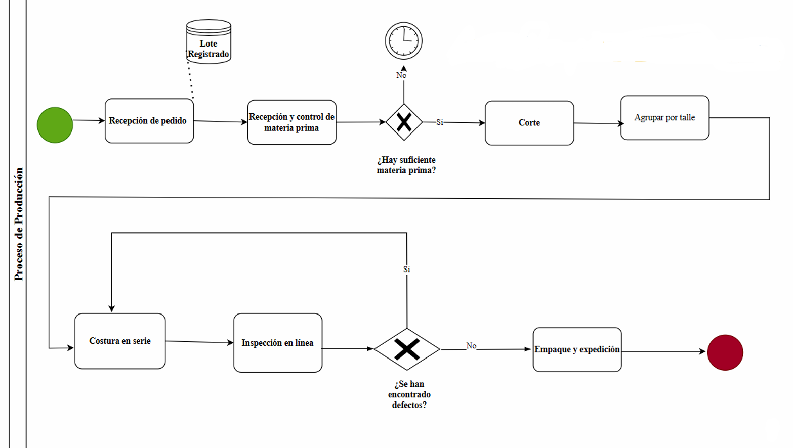
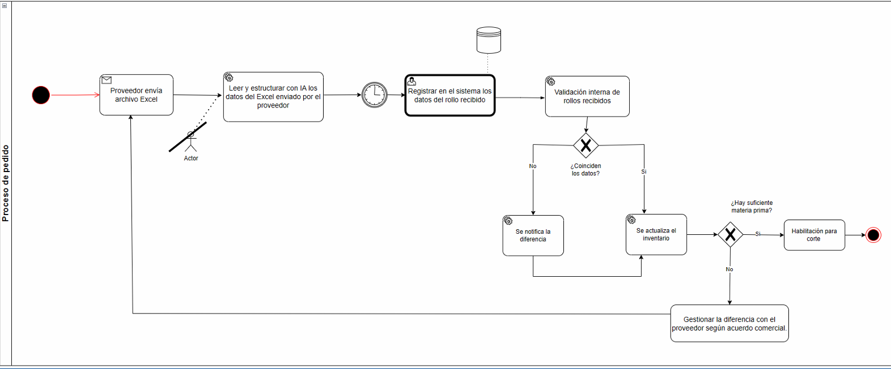
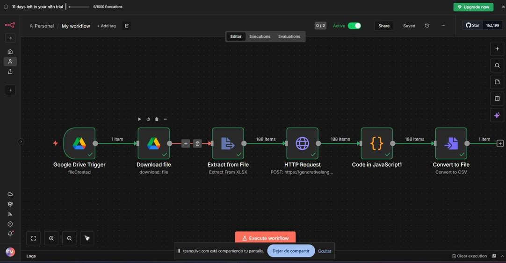
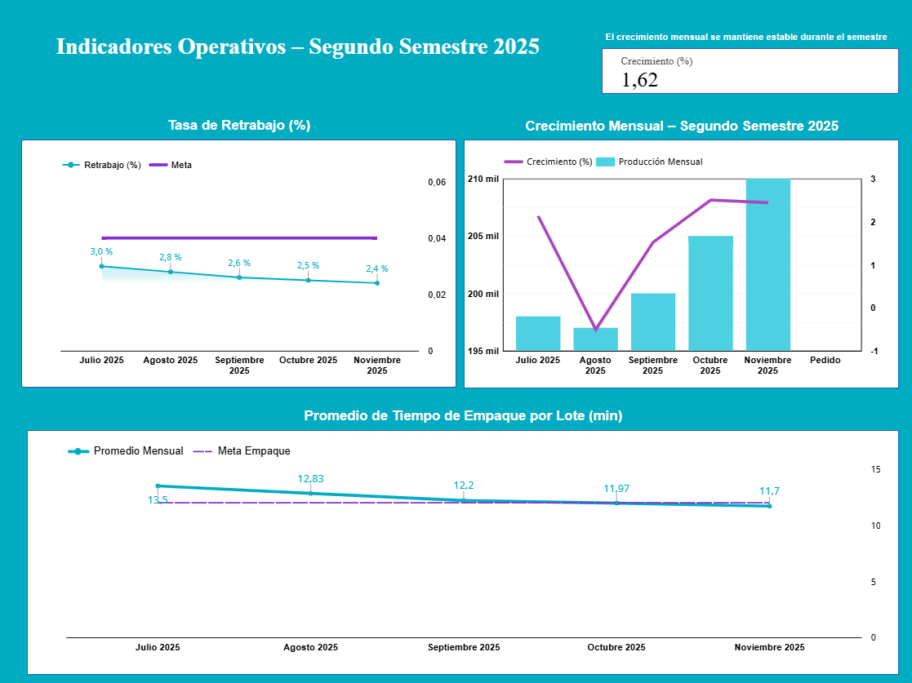

# CINTEX Manufacturing Process Optimization

## Project Overview

This project focused on analyzing and improving manufacturing processes within a textile maquila company (anonymized as **"CINTEX"** for confidentiality purposes).

The objective was to identify operational inefficiencies, analyze production workflows, design performance indicators (KPIs), and evaluate automation opportunities through digital transformation initiatives.

The project combined business process analysis, manufacturing operations assessment, KPI design, workflow automation evaluation, and proof-of-concept development.

---

## Business Context

CINTEX operates in a manufacturing environment where production efficiency, quality control, traceability, inventory visibility, and timely information flow are critical for operational success.

To support continuous improvement initiatives, a comprehensive analysis of production and administrative processes was conducted to identify bottlenecks and improvement opportunities.

---

## Project Objectives

- Analyze existing manufacturing processes
- Identify operational bottlenecks
- Design and evaluate KPIs
- Improve process visibility and reporting
- Evaluate automation opportunities
- Explore AI applications for operational efficiency
- Propose digital transformation initiatives

---

## Methodology

- Business Process Analysis
- Manufacturing Process Mapping
- BPMN Modeling
- Bottleneck Identification
- KPI Design
- Root Cause Analysis
- Digital Transformation Assessment
- Automation Opportunity Evaluation

---

## Current Challenges

Key issues identified during the analysis included:

- Manual administrative tasks
- Information delays
- Limited process visibility
- Production bottlenecks
- Inefficient data management
- Repetitive operational activities
- Lack of automated data processing
- Limited traceability of operational information

---

## Manufacturing Process Mapping

### Current Production Process

The existing production workflow was analyzed and documented using BPMN to understand material flow, production activities, quality control checkpoints, and operational dependencies.

This analysis provided visibility into the manufacturing process and helped identify potential bottlenecks and process inefficiencies.

---

## Supplier Data Reception Process

A separate administrative process related to supplier data registration was selected for automation analysis.

The original workflow required manual processing of supplier spreadsheets before inventory registration, creating delays and repetitive administrative work.

A redesigned BPMN model was developed to evaluate the integration of AI-assisted data extraction and automated validation.

### Proposed Automated Process

---

## Automation Prototype

A proof-of-concept workflow was developed using **n8n** and **Gemini AI**.

The objective was to automatically process supplier Excel files, extract relevant information, transform the data structure, and prepare it for integration into internal processes.

The prototype demonstrates the feasibility of reducing manual effort and improving data processing efficiency.

### n8n + Gemini AI Workflow

---

## KPI Dashboard

A dashboard prototype was designed to monitor operational performance indicators and support management decision-making.

The dashboard included metrics such as:

- Production Growth Rate
- Rework Rate
- Packaging Time per Batch
- Operational Efficiency Indicators
- Process Performance Metrics

### Dashboard Prototype

---

## Proposed Improvements

The project proposed a combination of:

- KPI-driven decision making
- Automated data collection
- AI-assisted document processing
- Workflow automation
- Improved reporting and traceability
- Better inventory visibility
- Integration with enterprise systems

---

## Automation Technologies Evaluated

Several technologies were evaluated as potential automation tools, including:

- n8n
- Gemini AI
- Power Automate
- UiPath
- Document AI
- Make

---

## Skills Demonstrated

- Business Analysis
- Business Process Modeling (BPMN)
- Manufacturing Operations Analysis
- Process Improvement
- KPI Design
- Data Analysis
- Business Intelligence
- Workflow Automation Assessment
- Digital Transformation
- Requirements Analysis
- Problem Solving
- Process Documentation

---

## Technologies & Concepts

- BPMN
- Manufacturing Analytics
- Process Optimization
- KPI Management
- Supply Chain Concepts
- Business Intelligence
- Workflow Automation
- AI Applications
- Information Systems Analysis
- Continuous Improvement
- Digital Transformation

---

## Key Outcomes

- Mapped and documented manufacturing processes
- Identified operational bottlenecks and inefficiencies
- Designed operational KPI framework
- Developed a dashboard prototype for performance monitoring
- Modeled an automation-oriented BPMN process
- Built an n8n + Gemini AI proof-of-concept workflow
- Evaluated digital transformation opportunities

---

## Confidentiality Note

The company name was anonymized as **"CINTEX"** to preserve confidentiality while maintaining the structure and business value of the case study.

All information presented focuses on methodologies, process analysis techniques, automation concepts, and improvement proposals developed during the project.
